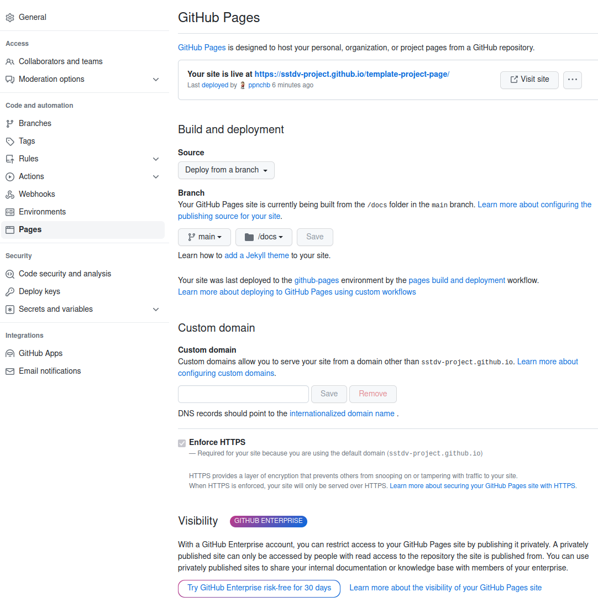

Template project page
===

## Project directory structure
```
.
├── README.md
├── LICENSE
├── src/
│   └── [Project source code]
└── docs/
    └── [Optional: project pages source code]
```

## Pages setting
To enable project pages,
* Go to Project settings > Pages
* Select 'Deploy from a branch' as the source
* Select `/docs` for the branch and save
* Project page will be deployed shortly



## Citation

BibTeX example
```bibtex
@article{knuth:1984,
  title={Literate Programming},
  author={Donald E. Knuth},
  journal={The Computer Journal},
  volume={27},
  number={2},
  pages={97--111},
  year={1984},
  publisher={Oxford University Press}
}
```

## Acknowledgement

###### Korean acknowledgement
> 이 논문은 20__년도 정부(과학기술정보통신부)의 재원으로 정보통신기획평가원의 지원을 받아 수행된 연구임 (No.00223446, 목적 맞춤형 합성데이터 생성 및 평가기술 개발)

###### English acknowledgement
> This work was supported by Institute for Information & communications Technology Promotion(IITP) grant funded by the Korea government(MSIT) (No.00223446, Development of object-oriented synthetic data generation and evaluation methods)